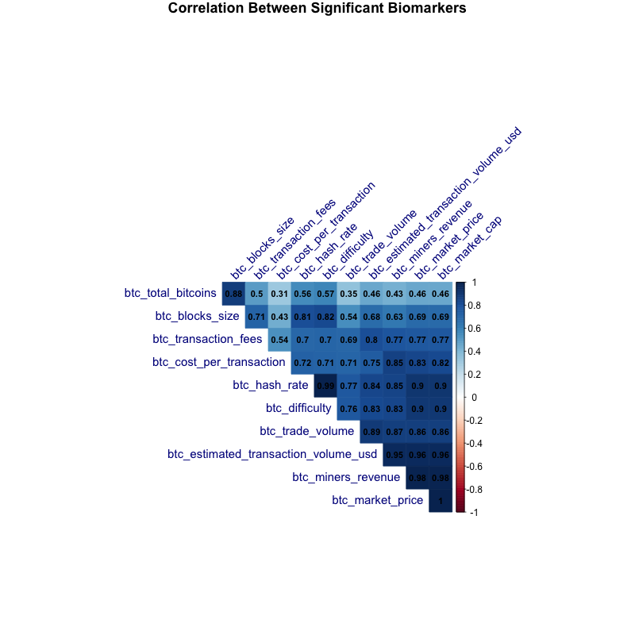

  
```{r setup, include=FALSE}
knitr::opts_chunk$set(echo = TRUE)
knitr::opts_chunk$set(message = FALSE)
knitr::opts_chunk$set(warning = FALSE)
```

### Challenge

***To forecast cryptocurrency prices using all the trading features like price, volume, open, high, low values present in the dataset.***

Probably one of the biggest things in recent years is Bitcoin. Bitcoin grew by around 800% last year, held a market cap of around 250 billion dollars, and sparked worldwide interest in cryptocurrencies. But what are cryptocurrencies? Basically they’re digital currencies that use complex computer algorithms and encryption to generate more currency and to protect transactions. What’s really cool about cryptocurrencies is that they utilize a network of thousands of computers that forward people’s transactions to what’s known as a blockchain (essentially a big record of transactions kept secure by the network of computers). Once a transaction is in the blockchain, it’s never coming out again; this protects cryptocurrencies from double-spends. So it’s pretty clear that cryptocurrencies are a cool new way to spend money — what if we could predict how its prices fluctuate?


By analyzing bit coin historical features, such as bitcoin tradevolume, bitcoin blockssize,
bitcoin difficultyto find a new block,total value of coinbase block rewards , transaction fees paid to miners, we can predict the variation and can predict the ups and downsof bitcoin price .


###  Data Description

+ The data used for this particular project is "Cryptocurrency Historical Prices by Sudalairajkumar". The data consists of information on the 17 currencies collected daily from various dates (Some January 2016, April 2013, August 2015, so on.) to October 2017. The original source of the data is coinmarketcap, Blockchain Info and Etherscan. (https://www.kaggle.com/sudalairajkumar/cryptocurrencypricehistory)

+ We are using Bitcoin Dataset (bitcoin_dataset.csv) in the above dataset.The details of attributes are following.

```{r, message = FALSE, echo=FALSE}
library(AppliedPredictiveModeling)
library(broom)
library(caret)
library(caTools)
library(class)
library(corrplot)
library(DataExplorer)
library(dplyr)
library(e1071) 
library(funModeling)
library(ggfortify) 
library(ggplot2)
library(gridExtra)
library(Hmisc)
library(ISLR)
library(kableExtra)
library(kknn)
library(knitr)
library(lattice)
library(mgcv)
library(MLeval)
library(multiROC)
library(nnet)
library(pander)
library(party)
library(pROC)
library(quantmod) 
library(readxl)
library(rpart)
library(rpart.plot)
library(scatterplot3d)
library( splines)
library(tidyverse)
library(visreg)
theme_set(theme_classic())


bitcoin_dataset <- read.csv(file = "/Users/nselvarajan/Desktop/R/Assignment5/bitcoin_dataset.csv", header = T,stringsAsFactors = T)
bitcoin_dataset <- data.frame(bitcoin_dataset, stringsAsFactors = FALSE)

df <- data.frame(Names = c("Date",
                           "btcmarketprice",
                           "btctotalbitcoins",
                           "btcmarketcap",
                           "btctradevolume",
                           "btcblockssize",
                           "btcavgblock_size",
                           "btcnorphaned_blocks",
                           "btcntransactionsperblock",
                           "btcmedianconfirmation_time",
                           "btchashrate",
                           "btc_difficulty",
                           "btcminersrevenue",
                           "btctransactionfees",
                           "btccostpertransactionpercent",
                           "btccostper_transaction",
                           "btcnunique_addresses",
                           "btcntransactions",
                            "btcntransactions_total",
                           "btcntransactionsexcludingpopular",
                           "btcntransactionsexcludingchainslongerthan_100",
                           "btcoutputvolume",
                           "btcestimatedtransaction_volume",
                           "btcestimatedtransactionvolumeusd"),
                  Description = c("Date - Date of observation",
                           "Numerical - Average USD market price across major bitcoin exchanges",
                           "Numerical - Total number of bitcoins that have already been mined",
                           "Numerical - Total USD value of bitcoin supply in circulation",
                           "Numerical - Total USD value of trading volume on major bitcoin exchanges",
                           "Numerical - Total size of all block headers and transactions",
                           "Numerical - Average block size in MB",
                           "Numerical - Total number of blocks mined but ultimately not attached to blockchain",
                           "Numerical - Average number of transactions per block",
                          "Numerical -  Median time for a transaction to be accepted into a mined block",
                           "Numerical - Estimated number of tera hashes per second the Bitcoin network is performing",
                          "Numerical - Relative measure of how difficult it is to find a new block",
                         "Numerical - Total value of coinbase block rewards and transaction fees paid to miners",
                        "Numerical - Total value of all transaction fees paid to miners.",
                        "Numerical - Miners revenue as percentage of the transaction volume.",
                        "Numerical - Miners revenue divided by the number of transactions",
                   "Numerical - Total number of unique addresses used on the Bitcoin blockchain. ",
                   "Numerical - Number of daily confirmed Bitcoin transactions",
                   "Numerical-  Total number of transactions ",
                   "Numerical- Total number of Bitcoin transactions, excluding the 100 most popular addresses",
                  "Numerical- Total number of Bitcoin transactions per day excluding long transaction chains",
                  "Numerical- Total value of all transaction outputs per day ",
                   "Numerical-  Total estimated value of transactions on the Bitcoin blockchain ",
                   "Numerical-  Estimated transaction value in USD value"
                  ))
kbl(df)%>%
 kable_paper(full_width = F) %>%
 column_spec(2, width = "30em")
```

###  Data Analysis

```{r, message = FALSE, echo=FALSE}
bitcoin_dataset<-na.omit(bitcoin_dataset)
bitcoin_dataset$Days <- 1:nrow(bitcoin_dataset) #Add column that adds a count of days for each row
bitcoin_dataset <- subset(bitcoin_dataset, bitcoin_dataset$btc_median_confirmation_time>0) #Subset of data that is clean
```


  + Plot missing values of all the features in the dataset.

```{r, message = FALSE, echo=FALSE}
plot_missing(bitcoin_dataset)
```

  + Ploting histograms for numerical variables.

```{r, message = FALSE, echo=FALSE}
plot_num(bitcoin_dataset)
```

  + Get  metric table with many indicators for all numerical variables, automatically skipping the non-numerical variables.

```{r, message = FALSE, echo=FALSE}

profiling_num(bitcoin_dataset)
```
  
  + Plot of daily bitcoin priceshows that this plot has a general upward trend with no obvious seasonality or intervention point. There is obvious changing variance. Successive observations suggest autoregressive behavior.

```{r, message = FALSE, echo=FALSE}
library(ggplot2)
ggplot(bitcoin_dataset, aes(bitcoin_dataset$Days, bitcoin_dataset$btc_market_price)) + 
  geom_point(color="firebrick") +
  ggtitle('BTC Value vs. Time') +
  theme(plot.title = element_text(size=20, face="bold", 
                                  margin = margin(10, 0, 10, 0)))+
  labs(x="Date", y="USD")+
  theme(axis.text.x=element_text(angle=50, vjust=0.5)) +
  theme(panel.background = element_rect(fill = 'lightblue'))
```

 + Plot of market price with market capitalization.There is a linear trend for market cap with respect to market price.

```{r, message = FALSE, echo=FALSE}
library(ggplot2)

ggplot(bitcoin_dataset, aes(bitcoin_dataset$btc_market_cap, bitcoin_dataset$btc_market_price)) + 
  geom_point(color="firebrick") +
  ggtitle('BTC Market Capitalization vs. Market Price') +
  theme(plot.title = element_text(size=19.5, face="bold", 
                                  margin = margin(10, 0, 10, 0)))+
  labs(x="Market Cap (USD)", y="Market Price (USD)")+
  theme(axis.text.x=element_text(angle=50, vjust=0.5)) +
  theme(panel.background = element_rect(fill = 'lightblue'))+
  stat_smooth(method = "lm",  formula = y ~ x, col = "yellow")
```

 + Correlation Plot to show the dependence between multiple variables in bitcoin dataset.Highlighting the most correlated variables in a data table. In this visual, correlation coefficients are also
displayed. 
 
```{r, message = FALSE, echo=FALSE}

str(bitcoin_dataset[,c(2:6,11,12,13,14,16,24)])
correlation_r <- rcorr(as.matrix(bitcoin_dataset[,c(2:6,11,12,13,14,16,24)]))
correlation_Matrix <- correlation_r$r
p_mat <- correlation_r$P


corr_graph<-corrplot(correlation_Matrix, type = "upper", order = "hclust", 
                     p.mat = p_mat, sig.level = 0.05)
#par(mfrow = c(1, 1))
plot(1,1,axes = FALSE)
png(height=800, width=800, pointsize=15, file="od20.png")
corsig<-corrplot(correlation_Matrix,number.cex=0.75,
                 method = "color",
                 #col = col(200),  
                 type = "upper", order = "hclust", 
                 addCoef.col = "black", # Add coefficient of correlation
                 tl.col = "darkblue", tl.srt = 45, #Text label color and rotation
                 # Combine with significance level
                 p.mat = p_mat, sig.level = 0.05, insig = "blank", 
                 # hide correlation coefficient on the principal diagonal
                 diag = FALSE,
                 title = "Correlation Between Significant Biomarkers",
                 mar=c(0,0,1,0)
)

```

+ Sometimes it's nice to quickly visualise the data that went into a simple linear regression, especially when you are performing lots of tests at once. Here is a quick and dirty solution with ggplot2 to create the following regression plot with respect to btc_market_price:

```{r, message = FALSE, echo=FALSE}

w1 <- ggplot(bitcoin_dataset, aes(y=btc_market_price, x=btc_market_cap)) + geom_point(colour="blue")
w1<- w1 + stat_smooth(method="lm", formula = y~poly(x,2))+ ggtitle("Regression Plot \n Polynomial \n Market Cap")

w2 <- ggplot(bitcoin_dataset, aes(y=btc_market_price, x=btc_hash_rate)) + geom_point(colour="blue")
w2<- w2 + stat_smooth(method="lm", formula = y~poly(x,2))+ ggtitle("Regression Plot \n Polynomial \n Hash Rate")

w3 <- ggplot(bitcoin_dataset, aes(y=btc_market_price, x=btc_difficulty)) + geom_point(colour="blue")
w3<- w3 + stat_smooth(method="lm", formula = y~poly(x,2))+ ggtitle("Regression Plot \n Polynomial \n Difficulty")

w4 <- ggplot(bitcoin_dataset, aes(y=btc_market_price, x=btc_miners_revenue)) + geom_point(colour="blue")
w4<- w4 + stat_smooth(method="lm", formula = y~poly(x,2))+ ggtitle("Regression Plot \n Polynomial \n Miners Revenue")

w5 <- ggplot(bitcoin_dataset, aes(y=btc_market_price, x=btc_estimated_transaction_volume_usd)) + geom_point(colour="blue")
w5<- w5 + stat_smooth(method="lm", formula = y~poly(x,2))+ ggtitle("Regression Plot \n Polynomial \n Transaction Volume USD")

grid.arrange(w1,w2,w3,w4,w5, ncol=2)
```

### Prepare Data for Regression

+ Select variables relevant to market price:Based on the variable importance, we will use btc_market_cap, btc_hash_rate,btc_difficulty, btc_miners_revenue, btc_estimated_transaction_volume_usd feature for further analysis. 


```{r, message = FALSE, echo=FALSE}

 subsets <- data.frame(   as.numeric(bitcoin_dataset$btc_market_price),
                           as.numeric((bitcoin_dataset$btc_market_cap)),
                           as.numeric(as.factor(bitcoin_dataset$btc_hash_rate)),
                           as.numeric((bitcoin_dataset$btc_difficulty)),
                           as.numeric((bitcoin_dataset$btc_miners_revenue)),
                           as.numeric((bitcoin_dataset$btc_estimated_transaction_volume_usd)))
colnames(subsets) <- c("Market Price", 
                       "Market Cap",
                       "Hash Rate", 
                       "Difficulty", 
                       "Miners Revenue", 
                       "Estimated Transaction Volume USD")
str(subsets)
```

+ Load the cleaned dataset: 
      -  Omit rows which has N/A.
+  Data slicing: 
      -  Dataset is split into 80 percent of training data, 20 % of test set.
 
```{r, message = FALSE, echo=FALSE}

bitcoin_datasetlm <- bitcoin_dataset

trainIndex1 <- createDataPartition(bitcoin_datasetlm$btc_market_price, p = 0.8, list=FALSE, times=3)
subTrain1 <- bitcoin_datasetlm[trainIndex1,]
subTest1 <- bitcoin_datasetlm[-trainIndex1,]

```

### Linear Regression To Predict Market Price


+  TrainingParameters : 
      -  train() method is passed with repeated cross-validation resampling method for 10 number of resampling iterations repeated for 3 times.

```{r, message = FALSE, echo=FALSE}
# setup cross validation and control parameters
control <- trainControl(method="repeatedcv", number=3, repeats = 3, verbose = TRUE, search = "grid")
```

+ RMSE or Root Mean Squared Error  is the default metrics used to evaluate algorithms on regression datasets in caret.RMSE or Root Mean Squared Error is the average deviation of the predictions from the observations. 

```{r, message = FALSE, echo=TRUE}

# setup cross validation and control parameters
metric <- "RMSE"
tuneLength <- 10

# Training process 
# Fit / train a Linear Regression model to  dataset
linearModelReg <- caret::train(btc_market_price~
                                 btc_market_cap+btc_hash_rate+
                                 btc_difficulty+btc_miners_revenue+
                                 btc_estimated_transaction_volume_usd
                       ,data=subTrain1, method="lm", metric=metric, 
                       preProc=c("center", "scale"), trControl=control, tuneLength = tuneLength)
summary(linearModelReg)
```

### Residual Analysis in Linear Regression
+ Linear regression is a statistical method for for modelling the linear relationship between a dependent variable y (i.e. the one we want to predict) and one or more explanatory or independent variables(X).

+ This residual plot will explain how residual plots generated by the regression function can be used to validate that some of the assumptions that are made about the dataset indicating it is suitable for a linear regression are met.There are a number of assupmtions we made about the data and these must be met for a linear model to work successfully and the standard residual plots can help validate some of these. These are:

   * The dataset must have some linear relationship
   * Multivariate normality - the dataset variables must be statistically Normally Distributed (i.e. resembling a Bell Curve)
   * It must have no or little multicollinearity - this means the independent variables must not be too highly correlated with each other. This can be tested with a Correlation matrix and other tests
   * No auto-correlation - Autocorrelation occurs when the residuals are not independent from each other. For instance, this typically occurs in stock prices, where the price is not independent from the previous price.
   * Homoscedasticity - meaning that the residuals are equally distributed across the regression line i.e. above and below the regression line and the variance of the residuals should be the same for all predicted scores along the regression line.
   * Four standard plots can be accessed using the plot() function with the fit variable once the model is generated. These can be used to show if there are problems with the dataset and the model produced that need to be considered in looking at the validity of the model. These are:

   * Residuals vs Fitted Plot
   * Normal Q–Q (quantile-quantile) Plot
   * Scale-Location
   * Residuals vs Leverage
   
   
+ Looking at the summary, it has p-value of 2.2e-16, which indicates that there is a highly statistically significant relationship between the two variables. So, why do we need to look at other things like residuals?

+ P-values by themselves can potentially be misleading without analyis of the residuals to ensure the model does not have any problems.

+ 1.Residuals vs Fitted Plot: Residuals represent variation left unexplained by the model.Residual plots are used to look for underlying patterns in the residuals that may mean that the model has a problem.For a correct linear regression, the data needs to be linear so this will test if that condition is met.


+ 2.Normal Q–Q (quantile-quantile) Plot
Residuals should be normally distributed and the Q-Q Plot will show this. If residuals follow close to a straight line on this plot, it is a good indication they are normally distributed.For our model, the Q-Q plot shows pretty good alignment to the the line with a few points at the top slightly offset. Probably not significant and a reasonable alignment.


+ 3.Scale-Location
This plot test the linear regression assumption of equal variance (homoscedasticity) i.e. that the residuals have equal variance along the regression line. It is also called the Spread-Location plot.
The residuals in our case have equal variance(occupy equal space) above and below the line and along the length of the line.


+ 4.Residuals vs Leverage
This plot can be used to find influential cases in the dataset. An influential case is one that, if removed, will affect the model so its inclusion or exclusion should be considered.An influential case may or may not be an outlier and the purpose of this chart is to identify cases that have high influence in the model. Outliers will tend to exert leverage and therefore influence on the model.An influential case will appear in the top right or bottom left of the chart inside a red line which marks Cook’s Distance. An example is shown below. The case on the right shows 4 item, in the red dashed line. Removing this from the dataset would have a significant affect on the model, which may or may not be desirable.

```{r, message = FALSE, echo=FALSE}

linearplotmodel<-lm( btc_market_price~
                       btc_market_cap+btc_hash_rate+
                       btc_difficulty+btc_miners_revenue+
                       btc_estimated_transaction_volume_usd, data = subTrain1)
plot(linearplotmodel,col="lightblue")
plot(linearplotmodel, 4,col="lightblue")
plot(linearplotmodel, 5,col="lightblue")


```


### Linear Regression Prediction & Accuracy.

```{r, message = FALSE, echo=FALSE}

predictions<-predict(linearModelReg,newdata = subTest1)

rmse<-RMSE( predictions, subTest1$btc_market_price)
paste("RMSE", rmse, sep=" ")

error.rate.linear=rmse/mean(subTest1$btc_market_price)
paste("Error rate", error.rate.linear, sep=" ")

linearr2= R2( predictions, subTest1$btc_market_price) 
paste("R2", linearr2, sep=" ")

lineardf <- data.frame( Algorithm="Linear Regression",RMSE = rmse, R2 = linearr2 , Error =error.rate.linear) 

```


### Polynominal Regression

+ Polynomial regression is a special case of linear regression where we fit a polynomial equation on the data with a curvilinear relationship between the target variable and the independent variables.

+ In a curvilinear relationship, the value of the target variable changes in a non-uniform manner with respect to the predictor (s).

+ poly function returns or evaluates orthogonal polynomials of degree 1 to degree over the specified set of points x: these are all orthogonal to the constant polynomial of degree 0. 

```{r, message = FALSE, echo=TRUE}

poly_reg<-lm( btc_market_price~
                poly( btc_market_cap,2)+ poly( btc_hash_rate,2)+
             poly( btc_difficulty,2)+ poly( btc_miners_revenue,2)+
             poly( btc_estimated_transaction_volume_usd,2), data = subTrain1)
summary(poly_reg)
```

### Polynomial Regression Prediction & Accuracy

```{r, message = FALSE, echo=FALSE}

predictionpoly1<-predict(poly_reg,newdata = subTest1)

rmsepoly<-RMSE( predictions, subTest1$btc_market_price)
paste("RMSE", rmsepoly, sep=" ")

error.rate.poly=rmse/mean(subTest1$btc_market_price)
paste("Error rate", error.rate.poly, sep=" ")

polyrsquare = R2( predictionpoly1, subTest1$btc_market_price) 
paste("R Square", polyrsquare, sep=" ")

polydf <- data.frame(Algorithm="Polynomial Regression", RMSE = rmsepoly, R2 = polyrsquare , Error =error.rate.poly) 

```

### Spline Regression

+ Spline is a special function defined piece-wise by polynomials. The term “spline” is used to refer to a wide class of functions that are used in applications requiring data interpolation and/or smoothing. The data may be either one-dimensional or multi-dimensional.
+ Spline Regression is one of the non-parametric regression technique. In this technique the dataset is divided into bins at intervals or points which we called as knots. Also this bin has its separate fit. 
+ The disadvantages of the polynomial regression can be overcome by using Spline Regression. Polynomial regression only captures a certain amount of curvature in a nonlinear relationship. An alternative, and often superior, approach to modeling nonlinear relationships is to use splines.
+ Splines provide a way to smoothly interpolate between fixed points, called knots. Polynomial regression is computed between knots. In other words, splines are series of polynomial segments strung together, joining at knots.
+ The generic function quantile produces sample quantiles corresponding to the given probabilities.
+ bs {splines} Generate the B-spline basis matrix for a polynomial spline.bs uses knots	which is
the internal breakpoints that define the spline.Typical values are the mean or median for one knot, quantiles for more knots.


```{r, message = FALSE, echo=TRUE}

knots <- quantile( subTrain1$btc_market_price, p = c( 0.25, 0.5, 0.75))

splinemodel<-lm( btc_market_price~
                bs( btc_market_cap, knots = knots)+ bs( btc_hash_rate, knots = knots)+
                bs( btc_difficulty, knots = knots)+ bs( btc_miners_revenue, knots = knots)+
                bs( btc_estimated_transaction_volume_usd, knots = knots), data = subTrain1)

```

### Spline Regression Prediction & Accuracy

```{r, message = FALSE, echo=FALSE}
predictionspline<-predict(splinemodel,newdata = subTest1)

rmsespline<-RMSE( predictionspline, subTest1$btc_market_price)
paste("RMSE", rmsespline, sep=" ")

error.rate.spline=rmsespline/mean(subTest1$btc_market_price)
paste("Error rate", error.rate.spline, sep=" ")

splinersquare = R2( predictionspline, subTest1$btc_market_price) 
paste("R Square", splinersquare, sep=" ")
# Model performance 

splinedf <- data.frame( Algorithm="Spline Regression",RMSE = rmsespline, R2 = splinersquare , Error =error.rate.spline) 
```

### Generalized Linear Model

+ Why Use GAM?Relationships between the individual predictors and the dependent variable follow smooth patterns that can be linear or nonlinear.
+ Mathematically speaking, GAM is an additive modeling technique where the impact of the predictive variables is captured through smooth functions which—depending on the underlying patterns in the data—can be nonlinear.
+ GAM can capture common nonlinear patterns that a classic linear model would miss.
+ GAM framework allows us to control smoothness of the predictor functions to prevent overfitting. By controlling the wiggliness of the predictor functions, we can directly tackle the bias/variance tradeoff.

```{r, message = FALSE, echo=FALSE}

mod_lm2 <- gam(btc_market_price ~ btc_difficulty+btc_miners_revenue+btc_estimated_transaction_volume_usd, data=bitcoin_dataset)

```

```{r, message = FALSE, echo=TRUE}

lmfit6 <- gam(btc_market_price ~ btc_estimated_transaction_volume_usd + btc_miners_revenue, data=bitcoin_dataset)

summary(lmfit6)

```


### GAM Regression Prediction & Accuracy

```{r, message = FALSE, echo=FALSE}
predictiongam<-predict(lmfit6,newdata = subTest1)

rmsegam<-RMSE( predictiongam, subTest1$btc_market_price)
paste("RMSE", rmsegam, sep=" ")


error.rate.gam=rmsegam/mean(subTest1$btc_market_price)
paste("Error rate", error.rate.gam, sep=" ")


rsquaregam = R2( predictiongam, subTest1$btc_market_price) 
paste("R Square", rsquaregam, sep=" ")


gamdf <- data.frame(Algorithm="GAM Regression", RMSE = rmsegam, R2 = rsquaregam , Error =error.rate.gam) 

```

### Scatter Plot 3D Visualization

```{r, message = FALSE, echo=FALSE}
s3d <- scatterplot3d(bitcoin_dataset$btc_estimated_transaction_volume_usd,
                     bitcoin_dataset$btc_miners_revenue,
                     bitcoin_dataset$btc_market_price, 
                     pch=16, highlight.3d = TRUE, type = "h", 
                     main = "Multi-Variable Regression 
                     \nMarket Price ~ Transaction Volume + Miners Revenue", 
                     xlab="Transaction Volume", 
                     ylab="Miners Revenue", 
                     zlab="Value (USD)", 
                     angle=35)
s3d$plane3d(lmfit6)

```

+ Visualization part of gam model

```{r, message = FALSE, echo=FALSE}
#Plotting the Model
par(mfrow=c(1,1)) #to partition the Plotting Window
plot(mod_lm2, all.terms = TRUE, color="lightblue") 
#se stands for standard error Bands```
```

+ Diagnosing GAM model issues 

```{r, message = FALSE, echo=FALSE}
gam.check(mod_lm2, k.rep=1000)
```

### Penalized Cubic Regression Spline

+ Cubic Regression Spline is specified by bs="cr". These have a cubic spline basis defined by a modest sized set of knots spread evenly through the covariate values. They are penalized by the conventional intergrated square second derivative cubic spline penalty.

```{r, message = FALSE, echo=TRUE}
mod_lm4 <- gam(btc_market_price ~ s(btc_total_bitcoins, bs="cr")+s(btc_avg_block_size, bs="cr")+
                 s(btc_transaction_fees, bs="cr"),
               data=bitcoin_dataset)
summary(mod_lm4)
```
+ Diagnosing Penalized Cubic Regression Spline GAM model issues 

```{r, message = FALSE, echo=FALSE}
gam.check(mod_lm4, k.rep=1000)

vis.gam(mod_lm4, type='response', plot.type='persp',
         phi=30, theta=30, n.grid=500, border=NA)
visreg2d(mod_lm4, xvar='btc_avg_block_size', yvar='btc_market_price', scale='response')
```

### Cubic Regression Spline Prediction & Accuracy


```{r, message = FALSE, echo=FALSE}

predictiongamsmooth<-predict(mod_lm4,newdata = subTest1)

rmsegamsmooth<-RMSE( predictiongamsmooth, subTest1$btc_market_price)
paste("RMSE", rmsegamsmooth, sep=" ")

error.rate.gam.smooth=rmsegamsmooth/mean(subTest1$btc_market_price)
paste("Error rate", error.rate.gam.smooth, sep=" ")

rsquaregamsmooth = R2( predictiongamsmooth, subTest1$btc_market_price) 
paste("R Square", rsquaregamsmooth, sep=" ")

gamsmoothdf <- data.frame( Algorithm="Cubic Regression Spline" ,RMSE = rmsegamsmooth, R2 = rsquaregamsmooth , Error =error.rate.gam.smooth) 
```

### Extreme Gradient Boosting

+ XGBoost is an implementation of the Gradient Boosted Decision Trees algorithm. 
+ XGBoost supports various objective functions, including regression, classification and ranking. 
+ XGBoost gives among the best performances in many machine learning applications. It is optimized gradient-boosting machine learning library. The core algorithm is parallelizable and hence it can use all the processing power of your machine and the machines in your cluster. In R, according to the package documentation, since the package can automatically do parallel computation on a single machine, it could be more than 10 times faster than existing gradient boosting packages.
+ XGBoost shines when we have lots of training data where the features are numeric or mixture of numeric and categorical fields. It is also important to note that xgboost is not the best algorithm out there when all the features are categorical or when the number of rows is less than the number of fields (columns).


```{r, message = FALSE, echo=FALSE}
bitcoin_dataset4 <- bitcoin_dataset[,c(2:6,11,12,13,14,16,24)]

trainIndex <- createDataPartition(bitcoin_dataset4$btc_market_price, p = 0.8, list=FALSE, times=3)
subTrain <- bitcoin_dataset4[trainIndex,]
subTest <- bitcoin_dataset4[-trainIndex,]
```

+ The data argument in the xgboost R function is for the input features dataset. It accepts a matrix, dgCMatrix, or local data file. The nrounds argument refers to the max number of iterations (i.e. the number of trees added to the model). 

+ There are different hyperparameters that we can tune and the parametres are different from baselearner to baselearner. In tree based learners, which are the most common ones in xgboost applications, the following are the most commonly tuned hyperparameters:

+ learning rate: learning rate/eta- governs how quickly the model fits the residual error using additional base learners. If it is a smaller learning rate, it will need more boosting rounds, hence more time, to achieve the same reduction in residual error as one with larger learning rate. Typically, it lies between 0.01 - 0.3

+ The three hyperparameters below are regularization hyperparameters.

+ gamma: min loss reduction to create new tree split. default = 0 means no regularization.

+ lambda: L2 reg on leaf weights. Equivalent to Ridge regression.

+ alpha: L1 reg on leaf weights. Equivalent to Lasso regression.

+ max_depth: max depth per tree. This controls how deep our tree can grow. The Larger the depth, more complex the model will be and higher chances of overfitting. Larger data sets require deep trees to learn the rules from data. Default = 6.

+ subsample: % samples used per tree. This is the fraction of the total training set that can be used in any boosting round. Low value may lead to underfitting issues. A very high value can cause over-fitting problems.

+ colsample_bytree: % features used per tree. This is the fraction of the number of columns that we can use in any boosting round. A smaller value is an additional regularization and a larger value may be cause overfitting issues.

+ n_estimators: number of estimators (base learners). This is the number of boosting rounds.

```{r, message = FALSE, echo=TRUE,warning=FALSE}
xgbGrid <- expand.grid(nrounds = c(140,160),  # this is n_estimators in the python code above
                       max_depth = c(10, 15, 20, 25),
                       colsample_bytree = seq(0.5, 0.9, length.out = 5),
                       ## The values below are default values in the sklearn-api. 
                       eta = 0.3,
                       gamma=0,
                       min_child_weight = 1,
                       subsample = 1
)

model_xgb <- train(btc_market_price ~ .,
                   data = subTrain,
                   method = "xgbTree",
                   preProcess = c("scale", "center"),
                   trControl = trainControl(method = "repeatedcv", 
                                            number = 5, 
                                            repeats = 3, 
                                            verboseIter = FALSE),
                   tuneGrid = xgbGrid,
                   verbose = 0)

model_xgb$results   
plot(model_xgb)
```


### Extreme Gradient Boosting  Prediction & Accuracy

```{r, message = FALSE, echo=FALSE}
pred_xgb = predict(model_xgb, subTest)

mse = mean((subTest[, 1] - pred_xgb)^2)
mae = caret::MAE(subTest[, 1], pred_xgb)
rmse = caret::RMSE(subTest[, 1], pred_xgb)

cat("MSE: ", mse, "MAE: ", mae, " RMSE: ", rmse)

x = 1:length(subTest[, 1])
plot(x, subTest[, 1], col = "red", type = "l",lty=3, lwd=3, xlab='x', ylab='y')
lines(x, pred_xgb, col = "blue", type = "l")
legend(x = 1, y = 5000,  legend = c("original test_y", "predicted test_y"), 
       col = c("red", "blue"), box.lty = 1, cex = 0.8, lty = c(1, 1))

rmseXgb<-RMSE( pred_xgb, subTest$btc_market_price)
paste("RMSE", rmseXgb, sep=" ")

error.rate.Xgb=rmseXgb/mean(subTest$btc_market_price)
paste("Error rate", error.rate.Xgb, sep=" ")


rsquarexgb = R2( pred_xgb, subTest$btc_market_price) 
paste("R Square", rsquarexgb, sep=" ")

gamstochasticdf <- data.frame(Algorithm="Extreme Gradient Boosting" ,RMSE = rmseXgb, R2 = rsquarexgb , Error =error.rate.Xgb) 

```

### Compare Regression Models

```{r, message = FALSE, echo=FALSE}

str(lineardf)
str(polydf)
str(splinedf)
str(gamdf)
str(gamsmoothdf)
str(gamstochasticdf)

```

### Conclusion
 As such, we provide evidence suggesting that technical analysis is useful in a market like bitcoin whose value is mainly driven by by fundamental factors. Extreme Gradient Boosting outperforms other model with lesser error and  with R2=1 the model completely fit.